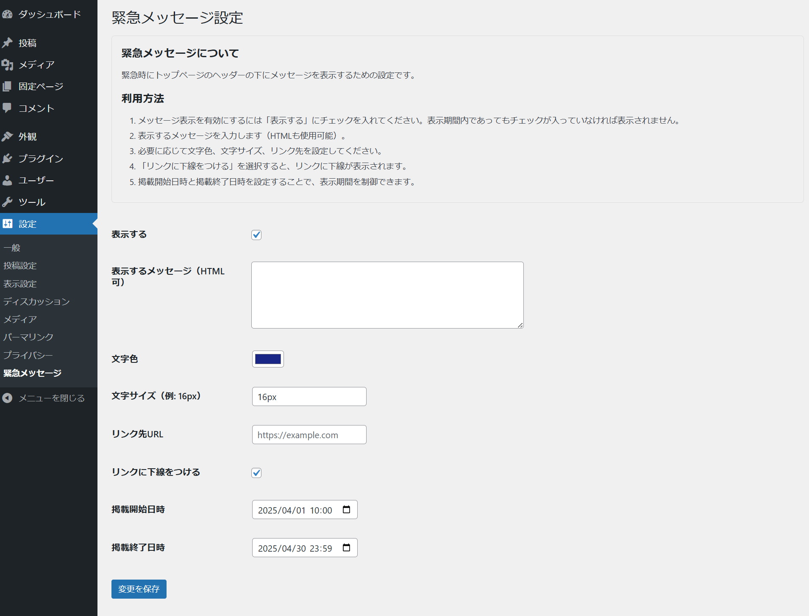

# Emergency Message
**Emergency Message**は、緊急時にWordPressサイトのトップページのヘッダーの下にメッセージを表示するためのプラグインです。管理画面からメッセージ内容や表示期間、スタイルを簡単に設定できます。

## 特徴
- トップページのヘッダーの下に緊急メッセージを表示
- メッセージの内容やスタイルを管理画面から設定可能
- 表示期間を指定して自動的にメッセージを表示・非表示
- リンクの設定や下線の有無を選択可能

## インストール方法
1. このリポジトリをダウンロードするか、`emergency-message`フォルダを作成してプラグインファイルを配置します。
2. WordPress管理画面にログインし、「プラグイン > 新規追加 > プラグインのアップロード」からプラグインをアップロードして有効化します。
3. 「設定 > 緊急メッセージ」から設定を行います。

## 利用方法
1. WordPress管理画面の「設定 > 緊急メッセージ」に移動します。
2. 以下の項目を設定してください：
   - **表示する**: メッセージを表示する場合はチェックを入れます。
   - **表示するメッセージ**: 表示するメッセージを入力します（HTMLも使用可能）。
   - **文字色**: メッセージの文字色を選択します。
   - **文字サイズ**: メッセージの文字サイズを指定します（例: `16px`）。
   - **リンク先URL**: メッセージにリンクを設定する場合はURLを入力します。
   - **リンクに下線をつける**: リンクに下線を表示する場合はチェックを入れます。
   - **掲載開始日時**: メッセージの表示を開始する日時を設定します。
   - **掲載終了日時**: メッセージの表示を終了する日時を設定します。掲載開始日時より以前の日時は設定できません。
3. 「変更を保存」をクリックして設定を保存します。
4. トップページの<header></header>の下に緊急メッセージが表示されます。

## スクリーンショット
### 設定画面

